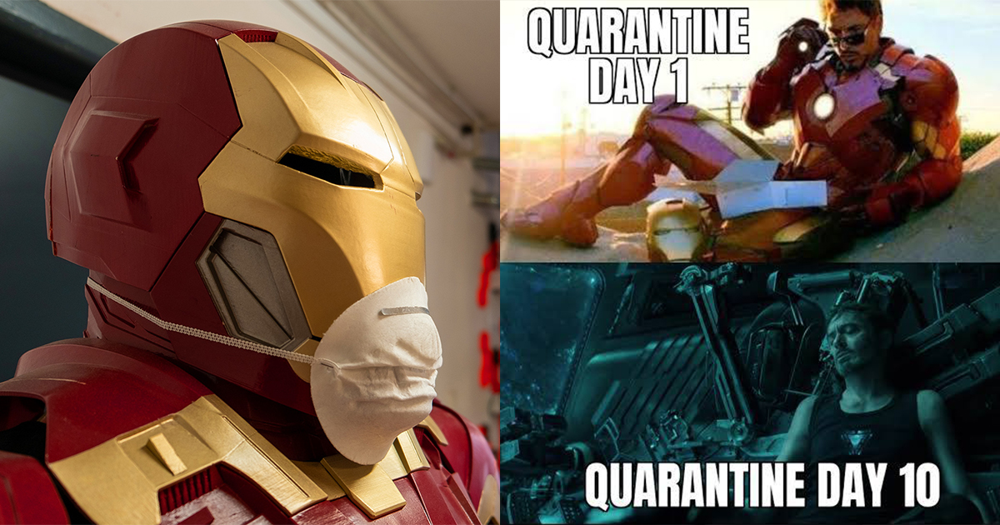

# How do I isolate at home when I am COVID-19 positive?

Welcome to quarantine method site!

## About isolate (taratahi) at home

Most people who are COVID-19 positive will have mild symptoms that can be easily managed at home.

Note: You might hear different ways to describe isolation like 'self-isolation', 'home quarantine' or 'home isolation'. They all mean isolating away from other members of your household (eg, have no physical contact, minimise time in shared spaces and do not share items such as cutlery and linen), while you remain in your own home.

- How to isolate (taratahi) at home [More information about isolation](https://www.healthnavigator.org.nz/health-a-z/c/covid-19-positive-how-to-quarantine-at-home/)

## It is very hard to isolate for 10 days. We totally understand! Please be patience and be kind!

## How do I isolate at home when I am COVID-19 positive?

If you have been told you are COVID-19 positive, or think you might be COVID-19 positive, it is important that you isolate at home. This means you don’t leave your home and you don’t have visitors to your home. This will help stop the virus from spreading. Being in isolation can be really hard, especially if you live with other people, or in smaller spaces. Read more about preparing for having COVID-19 in your home.
